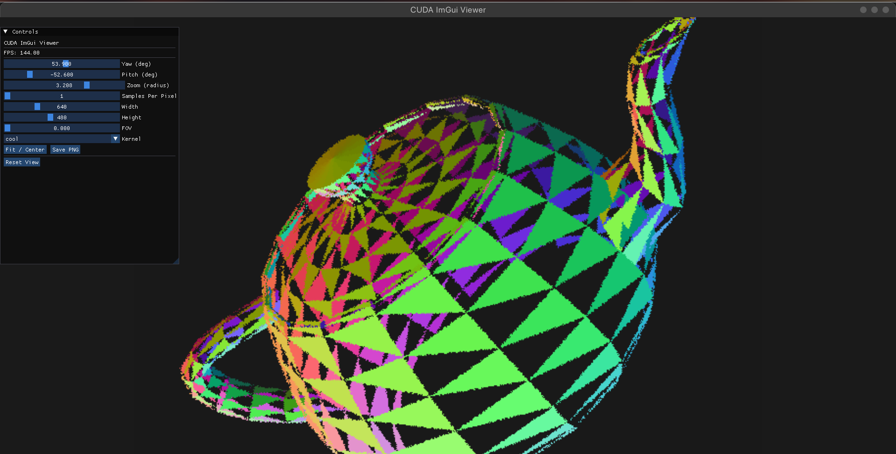
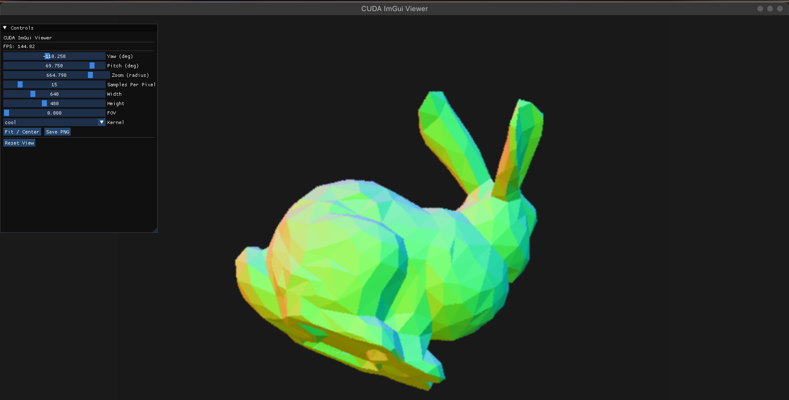

## Install(if missing)
```bash
sudo apt-get install libglfw3-dev
sudo apt-get install libglew-dev
sudo apt-get install libgl1-mesa-dev
sudo apt-get install libglu1-mesa-dev
sudo apt-get install build-essential
sudo apt-get install cmake

```

## Configure

```bash
cmake -S src -B build

[or]

./c
```

## Build

```bash
cmake --build build --target cuda_demo -j8

[or]

./b
```

## Run

```bash
./build/cuda_demo models/teapot.off

[or]

./r models/teapot.off
```

## Clean
```bash
rm -rf build

[or]

./c
```


## Images


